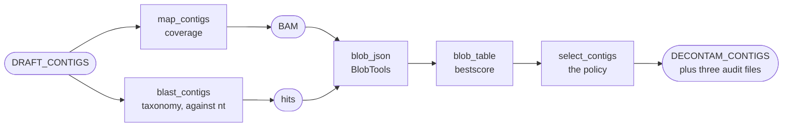

# Decontamination

An isolate assembly is not guaranteed to be one organism. Culture contaminants, index
hopping, carry-over from a neighbouring library and adapter or vector debris all
arrive as extra contigs. BacFlux asks two questions about every contig — what does it
look like taxonomically, and how deeply is it covered by this sample's own reads — and
uses the answers to keep the isolate and discard the rest.

The step runs **before** annotation, and that order is the point. A contaminant contig
left in inflates CheckM's contamination estimate, can pull GTDB-Tk off the right
lineage, and pollutes every gene, AMR and plasmid call after it.

Everything here lives in `workflow/rules/shared/10_decontam.smk`. The screen itself is
the same in all four modes; what changes is the aligner behind the coverage track,
where the screen sits in the assembly chain, and one extra BLAST that only the
long-read modes need.

## The chain



## Where it sits in each mode

The screen always runs on the **draft** assembly. What it writes, and who consumes
that, depends on the mode:

| Mode | Screened draft | Selector writes | Consumed next by |
|---|---|---|---|
| `illumina` | SPAdes `contigs_filt.fasta` | `contigs_final.fasta` | every downstream stage — decontamination *is* the last assembly step |
| `contigs` | filtered input `contigs_filt.fasta` | `contigs_final.fasta` | as above |
| `nanopore` | the dnaapler-reoriented Flye assembly | `contaminants/assembly_decontam.fasta` | Medaka, which then produces `contigs_final.fasta` |
| `hybrid` | the **Illumina** SPAdes draft | `contaminants/contigs_sel.fasta` | the Snippy reference, the QC comparator genome, and — through the reads that map to it — Filtlong's short-read reference |

That split is why the selector writes a path of its own rather than always writing the
delivered genome: in `nanopore` and `hybrid` the genome is produced later by the
mode's front end, and hard-coding the final name here would make `nanopore` circular
(select → final → Medaka → select).

## 1. Coverage — the reads mapped back onto the draft

*Rule `map_contigs`, plus `index_contigs` in the short-read modes.*

Mapping a sample's own reads onto its own assembly gives per-contig read depth. A
contig from a minor contaminant is usually covered at a very different depth from the
isolate's chromosome, and that depth is the second axis — alongside taxonomy — that
BlobTools separates organisms on.

The rule produces the same two files in every mode but gets there differently. The
branch is decided while Snakemake parses the workflow, before any job runs, so exactly
one rule body exists in a given run.

| Mode | Aligner | Command | Environment |
|---|---|---|---|
| `illumina`, `hybrid` | Bowtie2 2.5.4 | `bowtie2-build` then `bowtie2 -x … -1 … -2 …` | `bowtie.yaml` |
| `nanopore` | minimap2 2.30 | `minimap2 -ax map-ont` | `minimap.yaml` |
| `contigs` | minimap2 2.30 | `minimap2 -a contigs contigs` | `minimap.yaml` |

Output in all three cases is `contaminants/{sample}_map.bam` plus its `.bai`, both
temporary. Snakemake keeps them until every consumer is done: BlobTools here, and —
wherever the mode has reads — [Qualimap](assembly-qc.md#mapping-quality-qualimap) in
the QC stage.

The Bowtie2 index is six `.bt2` files, also temporary — rebuilding it is cheaper than
storing it, and it is useless once the BAM exists.

!!! warning "In `contigs` mode the coverage track is deliberately fake"

    There are no reads: the contigs are mapped against **themselves**, because
    `blobtools create -b` insists on a BAM. The resulting depth is near-uniform and
    carries no information, so **coverage-based separation in BlobTools is meaningless
    in this mode** — only the taxonomy leg is doing real work. It is also why
    `contigs` mode has no Qualimap report: a mapping-quality chart of a self-alignment
    would be a chart of nothing.

## 2. Taxonomy — megablast against NCBI nt

*Rule `blast_contigs` (BLAST+ 2.17.0).*

Every draft contig is searched against the NCBI nucleotide database, keeping the top
hits together with their taxids and subject titles. `megablast` rather than plain
`blastn`, because near-identical matches to known genomes are what an isolate assembly
is expected to produce, and it is far faster.

```bash
BLASTDB=/path/to/blast_db \
blastn -task megablast \
  -query contigs_filt.fasta \
  -db /path/to/blast_db/core_nt \
  -outfmt '6 qseqid staxids bitscore pident evalue length qlen slen qcovs qcovhsp sskingdoms scomnames sscinames sblastnames stitle' \
  -evalue 1e-5 -max_target_seqs 50 -max_hsps 5 \
  -num_threads {threads} -out {sample}_blastout
```

Which subfolder of the database is searched comes from one config key:

```yaml
parameters:
  nt_version: core_nt        # core_nt | nt_prok
```

The `BLASTDB` environment variable points at the **directory** so that the taxonomy
dump is found; `-db` points at the versioned subfolder inside it. `nodes.dmp` and
`names.dmp` must sit in that same directory — see
[Reference databases](../getting-started/databases.md). BlobTools is what reads those
two files, and `blob_json` declares them as *inputs* rather than parameters, so a
missing or incomplete taxonomy dump stops the run up front instead of half-way
through.

!!! warning "Do not reorder the `-outfmt` columns"

    `stitle` is deliberately **last**. The plasmid stage greps that column for the
    word "plasmid" to verify Platon's calls. Drop or move `stitle` and the grep
    silently matches nothing: every plasmid comes back "not verified by BLAST search",
    with no error and no warning.

### A second BLAST in the long-read modes

*Rule `blast_final_contigs`, defined only in `nanopore` and `hybrid`.*

The plasmid check looks each Platon-called contig up in a BLAST table **by contig ID**,
so the table has to have been computed over the contigs Platon actually reported on. In
the long-read modes it was not:

- in `hybrid` the screen above ran on the Illumina draft while Platon runs on the
  delivered Oxford Nanopore genome — SPAdes names contigs `NODE_1_length_…`, Flye
  names them `contig_1`, and no ID would ever match;
- in `nanopore` the screen ran on the pre-Medaka assembly while Platon runs on the
  post-Medaka consensus, and nothing guarantees Medaka preserves contig headers.

So both long-read modes run the identical megablast a second time over the delivered
genome, writing `contaminants/{sample}_final_blastout`. BlobTools always uses the draft
table; only the plasmid stage reads this one. In `illumina` and `contigs` mode the
second rule does not exist and the two paths are the same file.

## 3. BlobTools joins coverage and taxonomy

*Rules `blob_json` and `blob_table` (BlobTools 1.1.1).*

`blobtools create` builds the blobplot database: per contig, its length, GC, coverage
and a taxonomic assignment resolved through the NCBI taxonomy dump. `blobtools view`
then flattens it:

```bash
blobtools view --input blob.blobDB.json --out bestscore \
  --taxrule bestsum --rank all --hits
```

A contig usually has many BLAST hits pointing at several taxa. The **bestsum** rule
sums bitscores per taxon and keeps the winner, at every rank from superkingdom down to
species. The result is `contaminants/bestscore.blob.blobDB.table.txt`, one row per
contig, and it is kept rather than deleted because it is the evidence behind every
keep-or-discard decision.

The selector reads the **genus** from that table, which is column 22 of
`--rank all` output. A row with fewer than 22 fields is skipped rather than
half-read; an empty genus cell becomes the literal `no-hit`.

This stage is completely mode-independent: same input shape, same command, same output
everywhere.

## 4. The selector — keep or drop, with a reason on every contig

*Rule `select_contigs`, running `workflow/scripts/10_decontam/select_contigs_by_taxonomy.py`.*

This is where contigs are actually kept or thrown away. The script reads the BlobTools
table, resolves each contig to a genus, applies the configured policy, and writes an
audit line for every contig either way.

It is stdlib-only Python with no conda environment of its own, so it runs in the
environment Snakemake was launched from.

### The policy

```yaml
parameters:
  decontamination:
    mode: auto                 # auto | include | exclude | off
    discard_no_hit: true       # drop contigs with no taxonomic hit
    include_genera:            # inline list to KEEP, e.g. "Bacillus;Priestia"
    include_genera_by_sample:  # PATH to a 2-column TSV (sample, genus)
    exclude_genera:            # inline list to DISCARD
    exclude_genera_file:       # PATH to a one-genus-per-line file
    sample_overrides:          # PATH to a per-sample override TSV
```

!!! note "Two different `mode` keys"

    The `mode` inside `parameters.decontamination` is the **filtering policy**. It has
    nothing to do with the top-level `mode:` key that chooses the pipeline front end.

| `mode` | What it keeps | When to use it |
|---|---|---|
| `auto` | the genus carried by the most **contigs** | a clean single-organism culture; the default |
| `include` | only the genera you list | you know what the isolate is, or a plasmid was lost (see below) |
| `exclude` | everything except the genera you list | you know what the contaminant is |
| `off` | everything — the audit files are still written | a clean clinical isolate, or when small replicons are the point |

`discard_no_hit` is applied **before** the mode logic, so it removes unplaced contigs
under `auto`, `include` and `exclude` alike, and in `auto` it also takes `no-hit` out
of the vote so unplaced contigs can never become the target genus. The only escape is
`mode: off`.

`config.yaml` ships it as `true`, which is right for bacteria: an unplaced contig is
usually short and low-coverage. It can equally be a small plasmid that `nt` has no near
neighbour for, which is why it is a switch and not a hard-coded rule. Keep the line
even when you want the default — delete it and the code falls back to `false`, the
opposite of what the template says.

### One example of each

Every genus list — in `config.yaml`, in a TSV cell, or in a file — accepts the **same
three separators**: a semicolon, a comma, or a tab. `"Bacillus;Priestia"`,
`"Bacillus,Priestia"` and a tab between them are identical to the parser. Spaces around
the separator are trimmed, so `"Bacillus; Priestia"` is fine too.

**Keep one genus in every sample.** The commonest case: you know what the batch is.

```yaml
parameters:
  decontamination:
    mode: include
    include_genera: "Bacillus"
```

**Keep several genera in every sample.** This is the one you asked about.

```yaml
    mode: include
    include_genera: "Bacillus;Priestia;Peribacillus"
```

**Discard a known contaminant from every sample**, keeping everything else.

```yaml
    mode: exclude
    exclude_genera: "Cutibacterium;Ralstonia"
```

**Keep a long shared discard list out of `config.yaml`.** The file is one genus per
line, `#` starts a comment, and its contents are *added* to `exclude_genera`.

```yaml
    mode: exclude
    exclude_genera: "GenusA"             # the one or two you want visible in the config
    exclude_genera_file: /path/to/known_contaminants.txt
```

```text
# known_contaminants.txt — genera this lab has decided are never the isolate.
# One per line; blank lines and # comments are ignored.
GenusB
GenusC
```

**Give one sample an extra genus, on top of the run-wide list.** Two columns, and a
sample may appear on more than one row *or* carry several genera in one cell.

```yaml
    mode: include
    include_genera: "Bacillus"
    include_genera_by_sample: /path/to/extra_genera.tsv
```

```text
sample     genus
AIT1183    Priestia
AIT4245    Peribacillus;Paenibacillus
```

AIT1183 keeps **Bacillus and Priestia**. AIT4245 keeps **Bacillus, Peribacillus and
Paenibacillus**. Every other sample keeps Bacillus alone.

**Change the policy itself for one awkward sample.** Columns `sample` and `mode` are
required; `include_genera`, `exclude_genera` and `discard_no_hit` are optional, and any
cell you leave blank falls through to the run-wide value.

```yaml
    mode: auto
    sample_overrides: /path/to/overrides.tsv
```

```text
sample     mode      include_genera          exclude_genera    discard_no_hit
AIT4261    off
AIT2969    include   Bacillus;Priestia
AIT1420    auto                                                false
```

`AIT4261` is filtered not at all — every contig kept, audit files still written.
`AIT2969` switches to `include` and keeps exactly those two genera, **replacing** any
run-wide `include_genera`. `AIT1420` stays on `auto` but keeps its unplaced contigs.

!!! tip "Which of the two per-sample files do I want?"

    Ask whether the sample needs **more** of what the batch already keeps, or
    **something different**. More → `include_genera_by_sample`. Different, or a
    different `mode` entirely → `sample_overrides`.

### Which keys apply to every sample, and which to one

This is the part worth reading twice, because the names do not tell you. **Two** of the
seven keys are per-sample, not one, and the two behave differently:

| key | applies to | how it combines |
|---|---|---|
| `mode` | every sample | — |
| `discard_no_hit` | every sample | — |
| `include_genera` | every sample | the base list to keep |
| `exclude_genera` | every sample | the base list to discard |
| `exclude_genera_file` | every sample | **adds to** `exclude_genera` |
| `include_genera_by_sample` | **one sample** | **adds to** `include_genera` for that sample |
| `sample_overrides` | **one sample** | **replaces** whatever the row fills in |

So yes: `include_genera: "Bacillus;Priestia"` keeps those two genera in **every** sample
of the batch. `exclude_genera` is the same, and `exclude_genera_file` is not a per-sample
mechanism at all — it is somewhere to put a long shared list so it does not clutter
`config.yaml`. Inline and file are added together, not chosen between.

The two per-sample keys are where the difference bites:

- **`include_genera_by_sample`** is a two-column TSV (`sample`, `genus`). Its genera are
  *added* to the run-wide `include_genera` for that sample. Use it when one isolate
  legitimately carries an extra genus and everything else about the batch is right.

- **`sample_overrides`** is a TSV with columns `sample`, `mode`, `include_genera`,
  `exclude_genera`, `discard_no_hit`. Each cell it fills in *replaces* the run-wide
  value for that sample; each cell left blank falls through. It is the only key that can
  change `mode` or `discard_no_hit` for a single sample — including turning filtering
  `off` for one awkward isolate while the rest of the batch is filtered normally.

!!! example "Adding versus replacing"

    Run-wide `include_genera: "Bacillus"`, and one sample needs *Priestia* too.

    - via `include_genera_by_sample` → that sample keeps **Bacillus and Priestia**
    - via `sample_overrides` with `include_genera = Priestia` → that sample keeps
      **Priestia only**, because the row replaced the list rather than extending it

    Both are reasonable; they are simply not interchangeable, and only one of them is
    what you usually mean.

The order the script resolves them is: run-wide settings first, then
`include_genera_by_sample` extends the include list, then a matching `sample_overrides`
row replaces whatever it names. Whatever survives is recorded per contig, with a reason,
in `contaminants/contig_taxonomy_decisions.tsv`.

Aliases apply in `auto` and `include` only. **`exclude` matching stays exact**: a broad
alias there would delete contigs the user never named.

!!! note "This is a safeguard, not taxonomic reconciliation"

    The table exists to stop false removals. It does not attempt to reconcile GTDB,
    NCBI and LPSN names, and an entry earns its place only when the two genera are
    close enough that a BLAST result can land on either.

### The composition report

`contaminants/{sample}_composition.txt` describes the assembly BlobTools saw, kept and
dropped contigs alike, with two figures per genus:

```text
Aneurinibacillus: bases 0.40  contigs 0.26
Bacillus: bases 0.29  contigs 0.30
```

`bases` is the share of the assembly's DNA; `contigs` is the share of the contig count.
**`auto` mode votes on the contig count**, so a genus can win the vote while another
genus holds most of the genome. When that happens the two columns disagree and the file
says so at a glance — the case above is real, and the wrong half of a single genome was
kept.

The file is sorted by DNA, which is the more honest ranking of "what is this sample
mostly made of". It is also read back by the annotation stage as Bakta's `--genus`
hint, and adding the second figure broke that reader's numeric sort: the genus Bakta
gets handed is the alphabetically last one, not the most abundant. See
[the genus hint](annotation.md#the-genus-hint).

### The two warnings

Both are advisory: they change no decision, they ask a human to look. They go to
`logs/select_contigs_{sample}.log`.

```text
WARNING: 4 genera each hold at least 5% of this assembly (Aneurinibacillus 40%, Bacillus 29%, ...).
Either the sample is a mixed culture, or one genome is being split across related genera
by the BLAST assignment. Check the kept/removed split in contig_taxonomy_decisions.tsv
before trusting this assembly.
```

```text
WARNING: decontamination is discarding 52% of the assembly (N of M bp). If the kept
assembly then looks incomplete but NOT contaminated, the filter has most likely
removed genome rather than contamination.
```

The thresholds are **5%** of the assembly's DNA for a genus to count as "major", **2**
major genera to trigger the first warning, and **20%** removed to trigger the second.
They come from one 56-isolate batch, in which 54 isolates had a single genus holding
essentially all the DNA and 55 discarded under 3% of it. The two exceptions were the
only two problem samples in the batch, and they failed in opposite directions:

- one genome split across four related genera — *Aneurinibacillus* 40%, *Bacillus* 29%,
  *Paenibacillus* 16%, *Brevibacillus* 11% — which discarded 52% of the assembly and
  ended up 28% complete and 0% contaminated;
- a genuine two-organism culture — *Priestia* 61% / *Bacillus* 39% — 100% complete and
  104% **contaminated**, i.e. two genomes in one assembly.

Zero false positives against the other 54. That is one batch, so treat the numbers as a
well-supported starting point rather than a calibrated cutoff.

A third message reports contigs that BlobTools judged but that are not in the FASTA at
all:

```text
WARNING: 3 contigs from BlobTools table were not found in FASTA.
```

The two inputs are joined on the contig ID, so this is the detector for a mismatched
pair of inputs or for an upstream step having rewritten headers.

### When nothing survives

If the policy keeps zero contigs the rule **fails** rather than writing an empty FASTA.
An empty file would let Snakemake mark the step complete and every stage from
annotation onwards would run on no sequence. The decisions file is written first, so it
is there to read: the `reason` column separates a policy naming the wrong genus from a
sample the taxonomy screen could not place at all.

## 5. Two ways this step deletes a real plasmid

Both are real, both have bitten, and they have different causes. Rule out both.

### Route 1 — `bestsum` follows database composition, not biology

Plasmids cross genus boundaries constantly. When a plasmid's best database neighbours
sit in a different genus from the host, `auto` mode drops it *precisely because* it is
mobile.

A measured case: on *K. pneumoniae* ATCC BAA-2146, plasmid pMYS (`NZ_CP006660.1`,
2,014 bp) was removed as *Escherichia*. Its single best BLAST hit was *K. pneumoniae*
at 100% identity over the full length — the correct answer — but bestsum sums bitscores
per taxon across all 95 hits, and because *E. coli* is hugely over-represented in `nt`,
*Escherichia* summed to **58,709** against *Klebsiella*'s **16,253**.

The same limitation applies in reverse: a genuine contaminant of the same genus but a
different species cannot be caught by a genus-level rule at all.

### Route 2 — in `hybrid`, a dropped contig takes its long reads with it

This one is worse, because the sequence disappears from the **assembly** rather than
merely from the taxonomy table. The chain:

```text
select_contigs keeps contigs by genus
    └─▶ only the Illumina reads mapping to the KEPT contigs become the short-read reference
            └─▶ Filtlong scores ONT reads by how well that reference covers them
                    └─▶ uncovered sequence scores as low quality and is discarded
                            └─▶ Flye never sees it
```

This is independent of the `parameters.long_read_qc` settings, which can delete a
small plasmid's reads for entirely different reasons — see
[Nanopore mode](../modes/nanopore.md).

### How to check

1. Open `02.assembly/{sample}/contaminants/contig_taxonomy_decisions.tsv` and look for
   any **discarded** contig of plausible plasmid size (~2–200 kb) whose
   `assigned_genus` differs from the sample's GTDB genus.
2. Compare the replicon count in `06.plasmids` with what you expect.
3. If a plasmid is missing from the assembly rather than merely from the plasmid call,
   this chain — not the assembler — is the likely cause.

### How to fix, then re-run

| Situation | Change |
|---|---|
| the plasmid was dropped as the wrong genus | `mode: include`, with `include_genera` listing **both** the host genus and the genus the plasmid was assigned to |
| small mobile replicons are the point of the study | `mode: off` |
| the contig was dropped for having no hit at all | `discard_no_hit: false` |
| one awkward isolate in an otherwise fine batch | `sample_overrides` or `include_genera_by_sample` |

Snakemake redoes only the affected steps.

## Output files

All under `02.assembly/{sample}/contaminants/`, except the delivered assembly.

| File | Kept? | What it is |
|---|---|---|
| `{sample}_blastout` | yes | the 15-column megablast table against `nt` |
| `{sample}_final_blastout` | yes | the same screen over the delivered genome; `nanopore` and `hybrid` only |
| `bestscore.blob.blobDB.table.txt` | yes | BlobTools' per-contig table — the evidence behind every decision |
| `{sample}_composition.txt` | yes | per-genus share of DNA and of contig count |
| `contig_taxonomy_decisions.tsv` | yes | **the audit trail** — every contig, its genus, kept or removed, and why |
| `contigs.list` | yes | the kept contig IDs; no rule reads it |
| `contigs_sel.fasta` / `assembly_decontam.fasta` | yes | the kept sequences in `hybrid` / `nanopore` |
| `{sample}_map.bam` + `.bai` | no | the coverage track; also feeds Qualimap |
| `blob.blobDB.json`, `blob.*.cov` | no | BlobTools intermediates |
| `{sample}_contigs.*.bt2` | no | the Bowtie2 index, short-read modes only |

In `illumina` and `contigs` mode the kept sequences are written straight to
`02.assembly/{sample}/contigs_final.fasta`, because decontamination is the last
assembly step there.

## What to check afterwards

- `contig_taxonomy_decisions.tsv` — before trusting the *absence* of anything.
- `{sample}_composition.txt` — the two columns should agree for a clean isolate.
- `logs/select_contigs_{sample}.log` — the two warnings, the kept/dropped counts, and
  the missing-contig message all land here rather than on the console.
- CheckM's completeness and contamination in [Assembly QC](assembly-qc.md) — high
  contamination means something got through; high completeness loss with *low*
  contamination usually means the filter removed genome.
