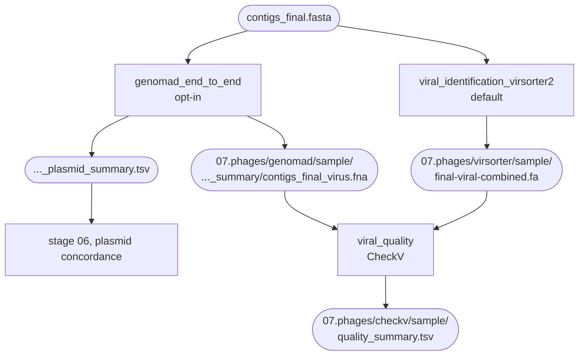

# Prophages

Stage `07.phages` looks for viral sequence in the finished genome — free phage contigs and
prophages integrated in the chromosome — and then grades what it found. It runs in all four
modes, and both callers read the same `contigs_final.fasta`, so nothing here branches on the
sequencing technology.

Two callers are wired in and exactly one of them runs, chosen by a single config key.
[CheckV](https://bitbucket.org/berkeleylab/checkv/src/master/) v1.0.3 runs either way,
because neither caller reports completeness or host contamination.

```yaml
phage:
  caller: virsorter2      # virsorter2 (default) | genomad (opt-in)
```



The two callers sit behind mutually exclusive guards, so only one set of rules is ever
defined. The run prints which one it is at startup: `Phage caller: virsorter2 (default).
Plasmid stage: Platon-only (geNomad off).`

## Choosing the caller

| | VirSorter2 2.2.4 | geNomad 1.12.0 |
|---|---|---|
| Status | default | opt-in |
| Licence | GPLv2 | Berkeley Lab, academic / non-commercial use |
| Finds | viruses | viruses **and** plasmids, in one run |
| Database | ~10 GB | ~1.5 GB |
| Also changes | nothing else | switches on the Platon + geNomad plasmid concordance in [stage 06](plasmids.md) |

VirSorter2 is the default because the whole default path — VirSorter2, Platon, CheckV — was
chosen with their licences in view, and geNomad's is the one that did not fit.
[Licensing](../about/licensing.md) records what each licensor published and where it was
read; read it before setting `genomad`.

Choosing geNomad also changes the plasmid stage, and that is the point rather than a side
effect: one geNomad run produces both a virus FASTA and a plasmid summary, so opting in hands
stage 06 a second, independent caller without a second run.

## VirSorter2

*Rules `virsorter2_db` (or `virsorter2_db_local`) and `viral_identification_virsorter2`.*

VirSorter2 scores contigs against curated viral HMM groups. BacFlux uses the settings from
the [VirSorter2 SOP](https://www.protocols.io/view/viral-sequence-identification-sop-with-virsorter2-5qpvoyqebg4o/v3?step=3):

| Setting | Value | Why |
|---|---|---|
| `--include-groups` | `dsDNAphage,NCLDV,RNA,ssDNA,lavidaviridae` | the five groups the SOP screens for |
| `--min-score` | `0.5` | deliberately loose, for sensitivity — CheckV downstream is what grades the result |
| `--keep-original-seq` | on | keeps the original sequence of circular and near-fully-viral contigs instead of VirSorter2's trimmed version, so CheckV sees the real contig |

| | |
|---|---|
| **In** | `contigs_final.fasta` + the VirSorter2 database |
| **Out** | `07.phages/virsorter/{sample}/` — key file `final-viral-combined.fa` |
| **Next** | CheckV |

The ~10 GB database is fetched once by `virsorter setup`. If you already hold a copy —
the directory that command produced, containing `hmm/`, `group/`, `rbs/` and `Done_all_setup` —
point `directories.vs2_db` at it and nothing is downloaded. BacFlux then builds a symlink view
of it rather than reading it in place, because Snakemake wipes a `directory()` output before
re-running its rule, and that must never happen to a database someone else shares.

!!! note "Why `envs/virsorter.yaml` lists so many packages"

    VirSorter2 is itself a Snakemake workflow, and left alone it builds a second conda
    environment at run time and does its real work inside that. That nesting is what broke
    every phage run before v2.0.0: an old transitive `mamba` against a modern `conda`, failing
    with `No module named 'conda._vendor.auxlib'`.

    BacFlux switches the nesting off — `virsorter setup --skip-deps-install`,
    `virsorter run --use-conda-off`, and the environment's own `bin` put first on `PATH` — which
    means every tool VirSorter2's internal rules call must already be in *our* environment. The
    bioconda `virsorter` package does not bring them: with `virsorter` alone, screed, hmmer,
    prodigal, last, pandas, scikit-learn, numpy, seaborn, imbalanced-learn and
    ncbi-genome-download were all absent and the run died at the first internal rule on
    `No module named 'screed'`. So `envs/virsorter.yaml` carries a copy of VirSorter2's own
    internal dependency list, pins included — its classifier ships as a pickled scikit-learn
    0.22.1 model, so the pins matter. If VirSorter2 is ever unpinned from 2.2.4, that list has
    to be re-synced against the `envs/vs2.yaml` inside the package.

## geNomad

*Rules `genomad_db` (or `genomad_db_local`) and `genomad_end_to_end`, defined only when
`phage.caller: genomad`.*

geNomad classifies each contig from its gene content against a marker-profile database, and
reports viruses and plasmids in the same run. BacFlux uses the default presets — neither
`--conservative` nor `--relaxed` — which is the combination CheckV is normally paired with,
and `--cleanup` to delete the intermediates.

| | |
|---|---|
| **In** | `contigs_final.fasta` + the geNomad database |
| **Out** | `07.phages/genomad/{sample}/contigs_final_summary/` — `contigs_final_virus.fna` and `contigs_final_plasmid_summary.tsv` |
| **Next** | CheckV (virus FASTA) and the plasmid concordance in stage 06 (plasmid summary) |

!!! warning "Get the database yourself if you opt in"

    `genomad download-database` is hard-coded to `portal.nersc.gov` — the same host whose
    outages forced the CheckV database onto a Zenodo mirror — and it has no `--url` option, so
    a mirror cannot be substituted the way `links.checkv_link` is. It fails as
    `URLError: [Errno 113] No route to host` when that host is down.

    BacFlux ships `links.genomad_link` pointing at the copy geNomad's own authors published on
    Zenodo (record 14886553, database v1.9), with `links.genomad_md5` beside it; a checksum
    mismatch stops the run rather than extracting a truncated archive. Change one and you must
    change the other. Better still, set `directories.genomad_db` to a copy you already hold —
    the inner `genomad_db/` directory, the one holding `version.txt` and `genomad_db.dbtype`,
    not its parent.

A local geNomad database is checked at parse time, before any job starts, because both ways it
can fail are slow and confusing to diagnose mid-run:

- **Partly readable.** On a shared copy it is easy for a few small files to end up mode 0640
  while the large data files beside them are world-readable — seen here as 11 of 27 files,
  including `version.txt` and the whole integrase set. `os.path.exists()` is true for a file
  you may stat but not read, so BacFlux tests real read access on every file and names the
  offenders.
- **Too old for the installed geNomad.** geNomad parses `genomad_marker_metadata.tsv` by
  position from the end of each row, so a database with one fewer trailing column shifts every
  field and dies minutes in on `invalid literal for int()` — a marker accession being read as a
  count. BacFlux checks for the `PREVIOUS_MARKER_ACCESSION` column instead of a version number,
  because that column's absence is the actual cause.

## CheckV

*Rule `viral_quality`, plus `checkv_db` or `checkv_db_local`.*

CheckV estimates how complete each predicted viral sequence is, flags host sequence left on
the ends of proviruses, and trims it. The same `checkv end_to_end` command grades either
caller's output, so one rule serves both paths — the caller's directory is chosen at startup
and the rule itself never knows which one it got.

| | |
|---|---|
| **In** | whichever caller's virus FASTA, plus the CheckV database |
| **Out** | `07.phages/checkv/{sample}/` — key file `quality_summary.tsv` |
| **Next** | this is the end of the stage; the CheckV directory is what `rule all` asks for, and asking for it is what pulls in whichever caller ran |

`quality_summary.tsv` is the file to read: one row per predicted viral sequence, with
`checkv_quality`, `completeness`, `contamination`, viral and host gene counts, and CheckV's
own warnings. Under VirSorter2, treat a low-completeness, high-host-gene row as what the loose
0.5 cutoff was expected to produce — the caller is deliberately sensitive, and this is the step
that says so.

!!! note "A genome with no phage does not fail"

    `checkv end_to_end` errors on an empty input, and a virus-free genome is a perfectly normal
    result. So the rule tests the caller's FASTA first: if it holds no sequences, it writes a
    header-only `quality_summary.tsv` and skips CheckV. An empty table means "nothing was
    called", not "something went wrong" — the log says which.

The shipped default is `checkv-db-v1.5`, fetched from an unmodified Zenodo mirror
(`links.checkv_link`) with its `.sha256` checked, or from CheckV's own downloader when that
link is cleared. Either way it lands in `07.phages/checkv_db/` and the rule finds the versioned
folder inside it at run time, so the two routes are interchangeable.

If you hold a copy already, set `directories.checkv_db` to the **parent** directory holding the
versioned folder. BacFlux symlinks the large files rather than copying them, but **rebuilds the
DIAMOND index** with this workflow's own DIAMOND: index formats are versioned, and an index
built by another site's DIAMOND makes CheckV fail deep into the completeness stage with
`DIAMOND task failed`. That rebuild costs about 950 MB against roughly 6.4 GB for a full copy.

## What this stage does and does not feed

The prophage calls are a deliverable in their own right. A prophage is a mobile element, so
[the mobilome module](../mobilome/index.md) counts this stage as part of its subject — but not
as an input: no rule in stage 08 opens a file under `07.phages/`. What stage 08 does consume is
the plasmid stage, and opting in to geNomad changes what *that* stage hands it, because the
concordance table is built here.

## What to check afterwards

- `07.phages/checkv/{sample}/quality_summary.tsv` — the graded calls, or a header-only file
  when nothing was called.
- `07.phages/virsorter/{sample}/final-viral-combined.fa` or
  `07.phages/genomad/{sample}/contigs_final_summary/contigs_final_virus.fna` — what the caller
  proposed before CheckV.
- `logs/viral_quality_{sample}.log` — CheckV's own output, or the "no viral sequences called"
  line.
- `logs/virsorter2_db.log`, `logs/genomad_db.log`, `logs/checkv_db.log` — the one-off database
  steps; the geNomad and CheckV logs record the checksum result. When you supplied the
  database yourself, the log is the `_local` variant of the same name.
