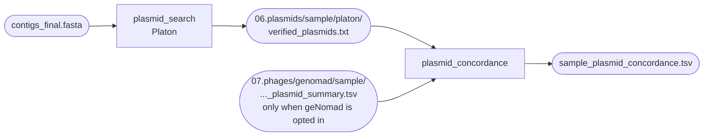

# Plasmids

Stage `06.plasmids` asks which contigs of the finished genome are plasmids rather than
chromosome. It runs in all four modes, and the caller reads only `contigs_final.fasta`, so
the call itself does not depend on which front end produced the assembly. The
supplementary BLAST line beside each call does — see below.

[Platon](https://github.com/oschwengers/platon) v1.8 is the caller and always runs.
[geNomad](https://github.com/apcamargo/genomad) is an optional second opinion: it is
switched on from the *phage* stage, not from here, because one geNomad run calls viruses
and plasmids together.



Which of the two end files is the deliverable depends on one config key:

| `phage.caller` | Plasmid deliverable | geNomad |
|---|---|---|
| `virsorter2` (default) | `06.plasmids/{sample}/platon/verified_plasmids.txt` | never runs |
| `genomad` (opt-in) | `06.plasmids/{sample}/{sample}_plasmid_concordance.tsv` | runs once per sample, in stage 07 |

Platon runs either way. See [Prophages](phages.md) for the caller choice itself.

## Platon

*Rule `plasmid_search`.*

Platon scores every contig on its protein content. Each protein family carries a
replicon-distribution score (RDS) — how much more often that family is seen on a plasmid
than on a chromosome — and the contig's summed score decides the call. It needs the
Platon database, set as `directories.platon_db`; see
[Reference databases](../getting-started/databases.md).

| | |
|---|---|
| **In** | `contigs_final.fasta`, plus a BLAST table computed over those same contigs (which one depends on the mode — see below) |
| **Out** | `06.plasmids/{sample}/platon/` — `contigs_final.tsv`, `contigs_final.plasmid.fasta`, `contigs_final.chromosome.fasta`, `verified_plasmids.txt` |
| **Next** | the concordance rule (when geNomad is on), and the mobilome module's replicon table (when it is on) |

Platon's own output files are named after the input, which is always `contigs_final.fasta`,
so the stem is `contigs_final` in every mode.

### The BLAST line beside each call

For every contig Platon calls a plasmid, the rule takes that contig's first line in the
BLAST table and asks — case-insensitively — whether it mentions "plasmid". In practice that
is the subject title, which is why
[Decontamination](decontamination.md#2-taxonomy-megablast-against-ncbi-nt) warns against
reordering the `-outfmt` columns. The answer is one line per contig in
`verified_plasmids.txt`:

```text
sample01: contig_3 is a plasmid.
sample01: contig_9 was not verified by BLAST search.
```

A genome Platon called no plasmid on gets a single `Platon found no plasmid in sample …`
line instead. That is a result, not an error.

The BLAST line is an annotation, never a filter — nothing is dropped on the strength of it.
Both signals can be fooled by the same thing: a mobile element sitting on a genuinely
chromosomal contig pushes Platon's score *and* that contig's best `nt` hit in the same wrong
direction, so agreement here is weaker evidence than it looks.

Which BLAST table is used differs by mode, and is resolved once at startup:

| Mode | Table | Why |
|---|---|---|
| `illumina`, `contigs` | the decontamination screen's own BLAST output | the screen already ran on this exact contig set |
| `nanopore`, `hybrid` | a second megablast over `contigs_final.fasta` (rule `blast_final_contigs`) | nothing guarantees Medaka preserves contig headers, and the hybrid screen runs on the Illumina draft, whose SPAdes `NODE_…` names can never match Flye's `contig_…` names |

The lookup is by contig ID, so the wrong table would report every plasmid as
"not verified by BLAST search" — silently, with no error. That is the reason it is resolved
centrally rather than per rule.

!!! warning "An almost-empty Platon directory is a normal result, not a failure"

    Platon refuses to classify a contig longer than **500 kb** (`MAX_CONTIG_LENGTH` in
    Platon's own source). A closed chromosome is therefore in *neither* the plasmid nor the
    chromosome FASTA — it was never assessed. On a complete Nanopore or hybrid assembly this
    is the usual case, and the per-contig table can legitimately be header-only.

    A real Platon crash looks different: the rule traps the exit status and writes one line,
    `{sample}: Platon exited with status N; see the log.`, into `verified_plasmids.txt`
    instead of killing the sample. That line is the only reliable signal that Platon failed,
    and both downstream readers key on it.

## geNomad as a second opinion

*Rule `plasmid_concordance`, defined only when `phage.caller: genomad`.*

geNomad classifies contigs from gene content against its own marker set — a different method
with different failure modes — so genuine agreement between it and Platon is much stronger
evidence than Platon agreeing with a BLAST screen that was run for another purpose. geNomad
is licensed by Berkeley Lab for academic / non-commercial use; the terms of every tool are
listed under [Licensing](../about/licensing.md).

The rule joins four files into one table: Platon's per-contig table, Platon's chromosome
FASTA, `verified_plasmids.txt`, and geNomad's plasmid summary from stage 07. One row per
plasmid **candidate** — the union of the two tools' plasmid calls. Contigs both tools agree
are chromosome are left out.

| Column | Holds |
|---|---|
| `sample`, `contig` | the join keys |
| `platon_call` | `plasmid` \| `chromosome` \| `not_called` \| `not_assessed` |
| `platon_rds` | Platon's replicon-distribution score, or `NA` |
| `platon_blast_hit` | `hit` \| `no_hit` \| `NA` — the supplementary BLAST line above |
| `genomad_call` | `plasmid` \| `absent` |
| `genomad_score`, `genomad_fdr` | geNomad's plasmid score, and its FDR when calibration ran (usually `NA`) |
| `agreement` | which tools called it |
| `confidence` | `high` \| `medium` \| `low`, from `agreement` alone |

Agreement drives the tier, and nothing is discarded — a disagreement is flagged and kept, so
the table is its own audit trail:

| Platon | geNomad | `agreement` | `confidence` |
|---|---|---|---|
| plasmid | plasmid | `both` | high |
| plasmid | — | `platon_only` | medium |
| not called | plasmid | `genomad_only` | medium |
| chromosome | plasmid | `conflict` | low |
| crashed | anything | `platon_unavailable` | low |

Three rows from the *Klebsiella pneumoniae* ATCC BAA-2146 positive control (`sample` and
`genomad_fdr` not shown). The two tools agree on all three plasmid contigs that reached this
stage — the genome's fourth plasmid never did, because decontamination had already removed it
(see below):

```text
contig          platon_call  platon_rds  platon_blast_hit  genomad_call  genomad_score  agreement  confidence
NZ_CP006661.1   plasmid      31.8        hit               plasmid       0.9925         both       high
NZ_CP006662.2   plasmid      20.1        hit               plasmid       0.9937         both       high
NZ_CP006663.1   plasmid      27.1        hit               plasmid       0.9943         both       high
```

!!! note "The comparison is not symmetric yet"

    The rule reads only geNomad's **plasmid** summary, which lists positive calls. So
    `genomad_call: absent` means "geNomad did not call this a plasmid" and cannot distinguish
    "it actively called it chromosome" from "it never scored it". The forward clash — Platon
    chromosome against geNomad plasmid — is flagged `conflict` / low. The reverse case, Platon
    plasmid against geNomad silence, is reported `platon_only` / medium rather than as a
    conflict. Nothing is hidden either way; only that one tier label is conservative.

If both tools called plasmids but **none** of their contig IDs match, the script says so
loudly in the log. The join has broken — a header not trimmed to its first token somewhere
upstream — and every genuine `both` / high has quietly split into two single-tool `medium`
rows.

## What the mobility ladder takes from here

When the [mobilome module](../mobilome/index.md) is on, it reads this stage rather than
re-detecting anything. Platon already answers both questions the top of the ladder needs:
whether a contig is a plasmid at all, and whether that plasmid carries the machinery to move
itself, from its own `# Conjugation`, `# Mobilization` and `# OriT` counts.

| Platon counts | Plasmid mobility | Ladder |
|---|---|---|
| conjugation genes present | `conjugative` | tier 6 — predicted self-transmissible |
| no conjugation, but a relaxase or an *oriT* | `mobilisable` | tier 5 — needs a helper |
| neither | `non-mobilisable` | — |

Conjugation is tested first because a relaxase is part of a conjugative system, not an
alternative to one. Contigs Platon skipped for length are called `chromosome` only at **2 Mb
and above**; between 500 kb and 2 Mb the replicon is reported `unknown`, because megaplasmids
of that size exist. When geNomad is on, the concordance table is passed in as well, so a
plasmid Platon missed does not silently become "chromosomal, intrinsic candidate".

## Before you conclude a plasmid is absent

!!! warning "Decontamination can remove a small plasmid before this stage sees it"

    The `auto` selector keeps contigs whose assigned genus matches the sample's dominant genus.
    A broad-host-range plasmid can be discarded precisely because it is mobile and its closest
    database relatives sit in another genus — the measured case is the 2,014 bp plasmid pMYS
    of the control genome above, dropped as *Escherichia*
    ([Decontamination](decontamination.md#route-1-bestsum-follows-database-composition-not-biology)).
    Check `02.assembly/{sample}/contaminants/contig_taxonomy_decisions.tsv` before trusting an
    absence. In `hybrid` mode there is a second route, worse than the first: a contig dropped
    there takes its long reads with it, so the sequence is missing from the assembly and not
    merely from the plasmid call
    ([Route 2](decontamination.md#route-2-in-hybrid-a-dropped-contig-takes-its-long-reads-with-it)).

Small plasmids are also lost upstream of that, at read filtering and assembly. The settings
that decide it are covered on [Nanopore mode](../modes/nanopore.md).

## What to check afterwards

- `06.plasmids/{sample}/platon/verified_plasmids.txt` — the per-contig call and its BLAST line,
  or the one-line Platon failure message.
- `06.plasmids/{sample}/{sample}_plasmid_concordance.tsv` — when geNomad is on, the tiered
  table, including every flagged conflict.
- `logs/plasmid_search_{sample}.log` — Platon's own verbose output.
- `logs/plasmid_concordance_{sample}.log` — the join summary: candidate contigs, how many
  scored `both`, how many conflicts, and how many geNomad IDs matched a Platon contig ID.
