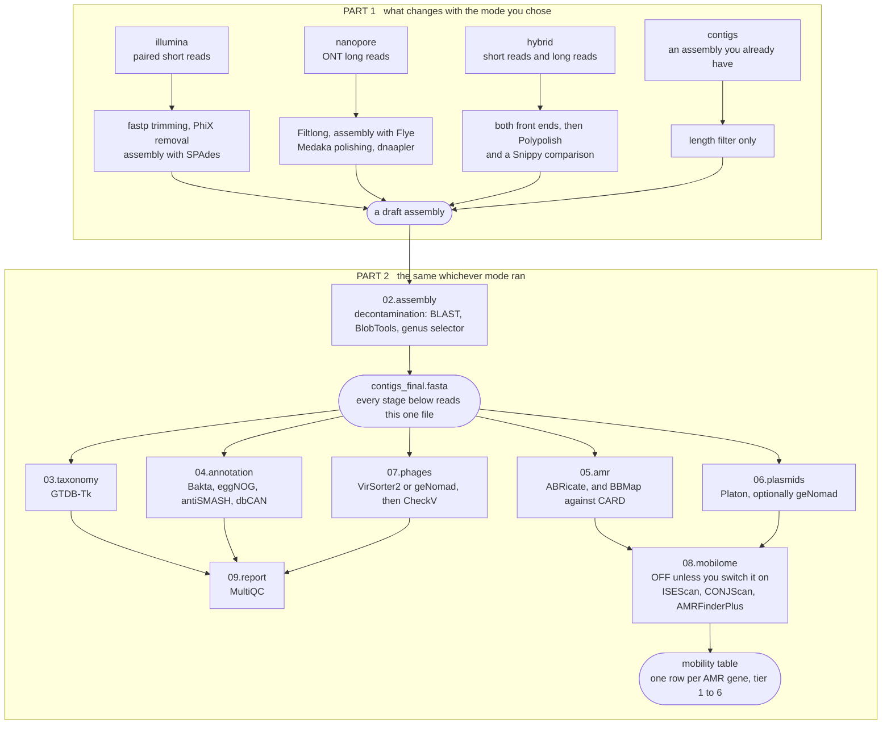
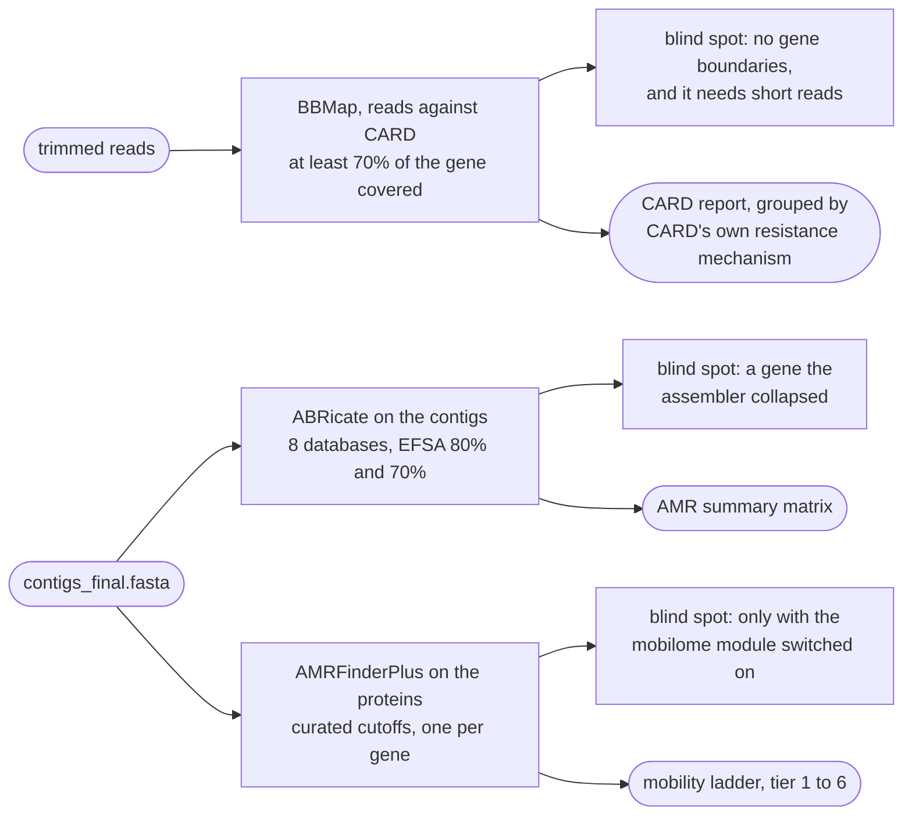

# Workflow architecture

BacFlux is one workflow with four ways in. Whichever way you enter, you leave through
the same nine numbered stages, and the `mode` key in the config decides nothing except
how a set of contigs gets produced in the first place.

!!! abstract "Terms used on this page"

    | | |
    |---|---|
    | **ONT** | Oxford Nanopore Technologies — the long-read sequencing platform |
    | **AMR** | antimicrobial resistance |
    | **EFSA** | European Food Safety Authority, whose thresholds the ABRicate leg applies |

## The shape of a run

The diagram is in two labelled halves. Everything in the first box changes with the
mode you chose; everything in the second box is the same whichever mode ran. That is
why there is one workflow instead of four.



Only `08.mobilome` is optional. Everything else runs on every sample, in every mode.

!!! note "Why the entry points converge so early"

    The four modes exist only because a genome can arrive as reads or as contigs, and
    reads can be short, long or both. Once there is a decontaminated assembly, nothing
    downstream cares how it was made — which is why Part 1 is short and Part 2 is
    everything else. The four v1 workflows shared roughly two-thirds of their code and
    had to be kept in step by hand; here that two-thirds exists once.

    One thing does stay mode-aware: a short-read assembly is more fragmented, so every
    mobilome call carries contig-edge flags and anything spanning contigs is capped at
    low confidence — see [the mobilome overview](mobilome/index.md).

## What runs where

| stage | runs in | optional? |
|---|---|---|
| `01.reads` | every mode that has reads | — |
| `02.assembly` | all four | — |
| `03.taxonomy` | all four | — |
| `04.annotation` | all four | — |
| `05.amr` | all four; the CARD read leg needs short reads | — |
| `06.plasmids` | all four | Platon always; the geNomad second opinion is opt-in |
| `07.phages` | all four | always runs; VirSorter2 by default, geNomad optional |
| `08.mobilome` | all four | **off by default** |
| `09.report` | all four | — |

## The three AMR legs, and why there are three

The one place BacFlux deliberately does the same job three times. Each leg fails in a
different way, so the three together say more than any one of them.



Read the detail on [the AMR page](analysis/amr.md).

## Where the files land

```text
output_dir/
├── 01.reads/       trimmed, PhiX-free, filtlong-filtered reads   (temporary)
├── 02.assembly/    draft and decontaminated contigs, CheckM, QUAST
├── 03.taxonomy/    GTDB-Tk classification
├── 04.annotation/  Bakta, eggNOG, antiSMASH, dbCAN
├── 05.amr/         ABRicate tables, CARD read mapping
├── 06.plasmids/    Platon calls, optional geNomad concordance
├── 07.phages/      prophage predictions, CheckV quality
├── 08.mobilome/    mobility table                    (only when switched on)
├── 09.report/      MultiQC
└── logs/           one log per rule, per sample
```

Every path and every file is listed on [the output reference page](reference/output.md).
