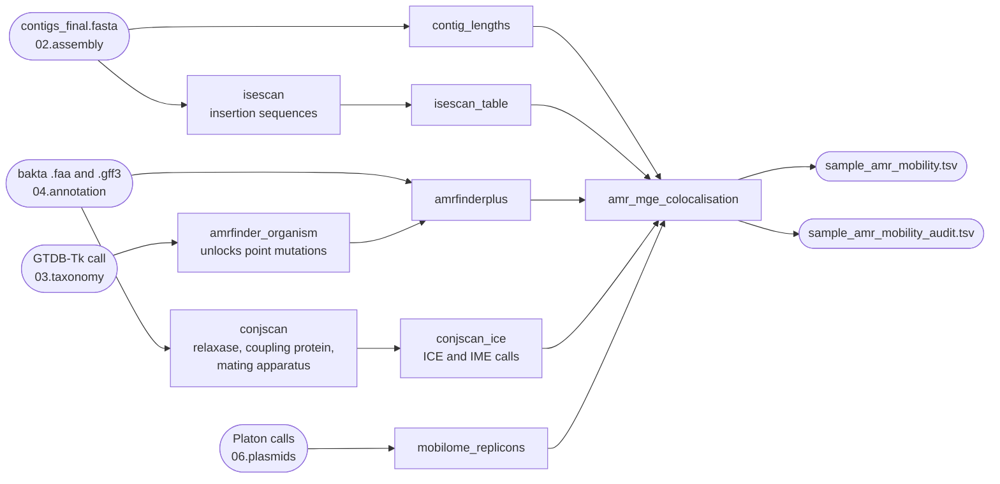

# Mobilome module

Stage `08.mobilome` answers one question, once for every antimicrobial resistance
gene BacFlux finds:

> **Is this gene embedded in a mobile genetic element, and if so, how transferable
> is that element?**

It is optional and off by default; everything below assumes you have switched it on
([Turning it on](enabling.md)).

!!! note "Four terms this section uses constantly"

    An **ICE** (integrative and conjugative element) sits in the chromosome and carries
    its own conjugation machinery, so it can move itself into another cell. An **IME**
    (integrative mobilisable element) sits in the chromosome and carries a **relaxase**
    — the enzyme that nicks the DNA to start a transfer — but no apparatus of its own,
    so it needs a helper element to move. An ***att* site** is the short direct repeat
    left at each end of an element where it integrated; finding the pair is how an
    element's true edges are established.

## Why a gene's address matters as much as its name

An AMR gene list tells you what an isolate can resist. It does not tell you whether
that resistance can move. A chromosomal efflux pump that every member of the species
carries, and a *bla*CTX-M sitting on a conjugative plasmid, produce the same kind of
line in an ABRicate table and mean very different things — only the second can end up
in another bacterium. That is the distinction regulators ask about: **intrinsic**
resistance versus **acquired**.

The module produces *supporting evidence* for that judgement, never the judgement
itself. [The mobility ladder](mobility-ladder.md) sets out the framing, the EFSA
definitions behind it, and why tier 1 says *candidate*.

## The mobility ladder

Every assessed gene gets exactly one tier. The label is written into the output table
next to the number, so nobody reading the TSV has to look a tier up.

| Tier | `mobility_tier_label` | Context |
|:--:|---|---|
| **1** | `intrinsic_candidate` | chromosomal, nothing mobile nearby |
| **2** | `expression_modulation_not_mobilisation` | an IS upstream, on the gene's strand — expression, **not** mobilisation |
| **3** | `composite_mobilisable_within_cell` | between two IS copies of one family: a composite transposon |
| **4** | `named_element_mobilisable` | inside a curated unit transposon or integron cassette |
| **5** | `mobilisable_needs_helper` | on a plasmid, or inside an IME |
| **6** | `predicted_self_transmissible` | inside an ICE, or on a conjugative plasmid |

The rungs are tested top down and the first match wins, so a curated transposon *on a
plasmid* scores 5 or 6 rather than 4. That order, the three distance windows behind
it, and how far to trust each rung — tier 4 rests on a single measured instance, and
tier 5's IME route on none — are all on
[The mobility ladder](mobility-ladder.md).

## What runs when you turn it on

The module adds **22 Snakemake rules**, of which **10 run on the default
configuration**. The other 12 belong to four optional layers, each of which stays off
until you give it a source ([Optional layers](optional-layers.md)).

Three things follow from that picture:

- **Two new tools, both from bioconda:** [ISEScan](https://github.com/xiezhq/ISEScan)
  v1.7.3 for insertion sequences, and
  [MacSyFinder](https://github.com/gem-pasteur/macsyfinder) v2.1.6 running the CONJscan
  models for conjugation machinery. Both are given up to 8 threads per sample.
- **No new database path to configure.** AMRFinderPlus is already installed by Bakta
  and reads its database from `{bakta_db}/amrfinderplus-db/latest`; the CONJscan
  models are fetched at run time, so the machine needs network access on the first run.
- **Stage 08 consumes earlier stages rather than repeating them.** It reads the
  assembly, the Bakta proteins and GFF3, the GTDB-Tk species call, and Platon's
  replicon calls from `06.plasmids`.

The ICE/IME caller, the composite-transposon test and the *att*-site search run in
**all four modes**, including `illumina`. The one leg that is mode-restricted is the
optional ISOSDB copy-number layer, which maps reads and therefore needs them —
`illumina` and `hybrid` only.

The deliverable is one row per AMR gene in `{sample}_amr_mobility.tsv`, with an audit
file beside it giving a reason for every gene left without context, every candidate
structure rejected and every confidence cap applied. Column by column:
[Reading the output](output.md).

## Why the mobilome spans three stages

Plasmids and prophages are mobile genetic elements too, so the output layout can read
as if `08.mobilome/` were "the mobilome" and `06.plasmids/` and `07.phages/` were
something else. They are not. The split is by *what question is being asked*, not by
whether the element is mobile.

| Stage | Question | Runs |
|---|---|---|
| `06.plasmids`, `07.phages` | what replicons and prophages are in this genome? (detection) | always |
| `08.mobilome` | is each AMR gene in a mobile element, and how transferable? (interpretation), plus IS, transposon, integron and ICE detection | opt-in |

Renaming `08.mobilome` was considered and deliberately rejected in favour of
explaining it. See [Plasmids](../analysis/plasmids.md) and
[Prophages](../analysis/phages.md) for the detection stages.

## Why it is off by default

**Scope.** Most characterisation rounds want the AMR gene list, not the mobility
argument behind it. The always-on AMR legs — ABRicate on the contigs, and the CARD
read screen in the modes that have short reads — are unaffected by this switch
([Antimicrobial resistance](../analysis/amr.md)).

**Cost.** Ten extra rules on the default path, three of them per-sample tool runs at
up to 8 threads, plus a one-off model download.

**Before you switch it on.** Turning the module on fetches the CONJscan model
package, which Institut Pasteur / CNRS license under **CC BY-NC-SA 4.0**. BacFlux
never ships it — you download it, under your own agreement with the licensor, exactly
as with `bakta_db` and the other user-supplied databases. Licence types for every
tool, model set and database are listed on [Licensing](../about/licensing.md).

## Three things to know before reading the output

**1. On a fragmented assembly a located IS count is a floor, not a count.** IS
elements are a leading cause of contig breaks: identical copies collapse in the
assembly graph, so the assembler cannot tell which flank belongs to which copy and
breaks there — the structure you are trying to detect is often what destroyed the
assembly. The AMR gene and its flanking IS regularly land on different contigs. Every row therefore carries `dist_to_contig_end`,
`is_at_contig_boundary` and `spans_contigs`, and the IS summary reports what fraction
of IS calls sit within 100 bp of a contig end (`mobilome.contig_boundary_bp`). Read
those before reading the counts.

**2. Never write "transmissible".** Tier 6 is `predicted_self_transmissible`, and the
prediction rests on finding conjugation machinery, not on watching a transfer happen.

**3. Confidence is tiered, never a bare call.** IS calling is imperfect even on
manually curated genomes: benchmarking four tools against a curated *E. coli*
annotation, Puterová & Martínek (2021) put the "improbable or not an IS element"
discovery rate between 0% and 23.7% depending on the tool, with **ISEScan — the caller
BacFlux uses — at 8.0%** (2.2% on their larger ISbrowser set). So every row carries
`confidence` (high / medium / low), and anything resting on a contig boundary or on a
partial hit is capped at `low`.

The module was validated on closed genomes and then measured again on deliberately
fragmented ones — 40 benchmark genomes cut to ~150 kb, ~50 kb and ~20 kb N50,
re-annotated and re-run end to end:

| | closed | 150 kb N50 | 50 kb N50 | 20 kb N50 |
|---|--:|--:|--:|--:|
| curated ICEs detected (of 18) | 15 | 15 | 15 | 12 |
| median called ÷ true element length | 0.55 | 0.45 | 0.34 | 0.22 |
| ICE/IME calls at `confidence: high` | 24% | 19% | 10% | 3% |

The **class** survives fragmentation; the **extent** does not. A low-confidence call
on a draft means the assembly could not support a stronger claim, not that the call is
wrong. Which columns to read and what not to conclude:
[Draft assemblies](draft-assemblies.md).

## Where to go next

| Page | What it covers |
|---|---|
| [The mobility ladder](mobility-ladder.md) | the six tiers in full, the IS-inside-CDS case, and the intrinsic-versus-acquired framing with its references |
| [Turning it on](enabling.md) | the one switch, and what each of the four optional layers needs before it will run |
| [Optional layers](optional-layers.md) | what each layer adds, what it costs, and where its data comes from |
| [Reading the output](output.md) | every column of `{sample}_amr_mobility.tsv`, the audit trail, and the rest of `08.mobilome/` |
| [Draft assemblies](draft-assemblies.md) | what fragmentation does to a call, and which columns still hold |
| [Tuning](tuning.md) | symptom to knob |
| [Worked example](worked-example.md) | one genome end to end, with the real rows |
| [Validation](validation.md) | the ICE and IME pilots, the negative control, the head-to-head against the EBI pipeline, and what the benchmark does not show |
