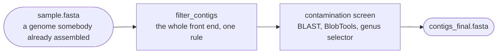

# Pre-assembled contigs mode

`mode: contigs` — the input is a genome somebody already assembled. There is no read
QC and no assembler, so the whole front end is **one rule**, whose job is to hand the
contamination screen a FASTA it can work with.

Use it for a genome from a collaborator, from a database, or from an earlier assembly.
Every analysis stage still runs; the mode cannot re-examine evidence that only
exists in reads.

Input files are `{sample}.<fasta|fa|fna>` in `input.contigs_dir`, and every file in one
batch must share the extension. A dotted name such as `my.genome.fasta` is read as
sample `my.genome`: the last dot splits off the extension, earlier dots stay in the
name.

!!! abstract "Terms used on this page"

    | | |
    |---|---|
    | **QC** | quality control |
    | **CARD** | Comprehensive Antibiotic Resistance Database |
    | **IS** | insertion sequence, the smallest kind of transposable element |
    | **AMR** | antimicrobial resistance |

## One rule, two branches

`filter_contigs` looks at the **first header** and takes one of two paths. SPAdes
writes the same style for every record, so one line is enough to decide.

| Branch | Trigger | What happens |
|---|---|---|
| **A** | the header matches `length_<n>` or `cov_<n>` | contigs under 500 bp or 2× coverage are dropped, both numbers read out of the header. Headers are kept exactly as they are |
| **B** | anything else | each header is trimmed to its first whitespace token. **No length filter and no coverage filter.** Nothing else changes |

The rule logs which branch it took, in the first line of
`logs/filter_contigs_{sample}.log`. It decides whether any filtering happened at all.

!!! note "Why branch B does not invent a filter"

    The length and coverage of each contig are read *out of the SPAdes header*. A
    genome from NCBI, from Flye, or from another assembler carries no such numbers, and
    guessing them would silently delete real sequence. So branch B removes nothing, and
    the only contigs that can leave the assembly are the ones the contamination screen
    drops.

    The rule name is misleading in that branch: it normalises headers rather than
    filtering. The normalisation matters — Bakta, Platon, geNomad and the BLAST screen
    all join on that first token.

## Decontamination does most of the work, with one hand tied

As in `illumina` mode, the screen's output is `contigs_final.fasta`. But BlobTools
combines two signals — BLAST taxonomy and read coverage — and this mode has no reads.
The contigs are mapped against themselves with minimap2 purely so BlobTools has a BAM
to read, which gives a near-uniform depth that carries no information.

So only the BLAST taxonomy leg is doing real work here. Every keep-or-drop decision
still lands in `contaminants/contig_taxonomy_decisions.tsv` with its reason, and reading
that file matters more in this mode than in any other. See
[Decontamination](../analysis/decontamination.md).

## What is absent, and why

| Missing | Reason |
|---|---|
| `01.reads/` | there are no reads to QC |
| `05.amr/mapping/` — the CARD read screen | it maps reads. ABRicate on the contigs still runs |
| Qualimap | the only alignment is the contigs against themselves; a report on it would say nothing |
| Circular-replicon information for Bakta | that comes from Flye's topology calls. Every sequence is annotated as linear |
| IS copy number in the mobilome module | it is a read-mapping leg |

Everything else — taxonomy, annotation, AMR and virulence screening, plasmids,
prophages, the optional mobilome module and the report — runs exactly as in the other
three modes.

## What it writes

| Path | Contents |
|---|---|
| `02.assembly/{sample}/contigs_filt.fasta` | branch A: the filtered assembly. Branch B: the same sequence with trimmed headers |
| `02.assembly/{sample}/contaminants/` | BLAST table, BlobTools table, the decision audit |
| `02.assembly/{sample}/contigs_final.fasta` | the delivered genome |

This mode replaces the separate `FastaFlux` workflow of v1. If you are migrating from
it, see [Coming from v1](../getting-started/from-v1.md).
