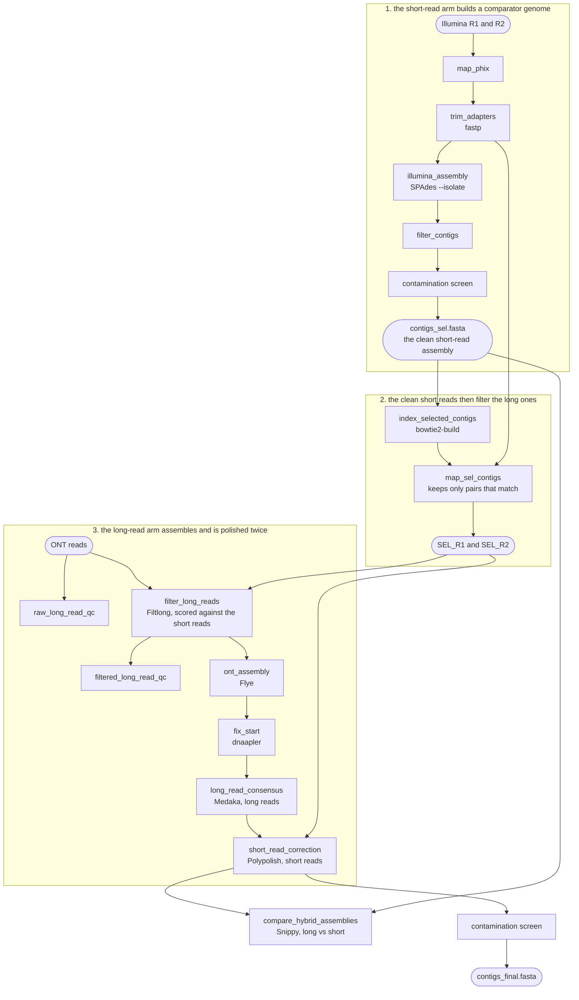

# Hybrid mode

`mode: hybrid` — Illumina and ONT reads from the same isolate. Sixteen rules, in
`workflow/rules/hybrid/`, and the most expensive mode to run: it assembles twice.

The two technologies have opposite error profiles. Long reads span the repeats that
break a short-read assembly but still get individual bases wrong, most often indels in
homopolymers, which frameshift genes and ruin an annotation. Short reads cannot span a
repeat but they get the base right. Hybrid mode builds the genome from the long reads
and then corrects it with the short ones.

Read it as three stages. The short reads are assembled **first**, not because that
assembly is the product, but because a clean short-read assembly is the best available
filter for the long reads: only the pairs mapping to it survive, and Filtlong then
scores every ONT read by how much of it those pairs support.

!!! abstract "Terms used on this page"

    | | |
    |---|---|
    | **ONT** | Oxford Nanopore Technologies, the long-read sequencing platform |

## The Illumina leg is the ONT leg's contamination filter

This is the design that makes the mode hybrid.

There is no BLAST/BlobTools screen on the long-read assembly. Instead the screen runs
on the **Illumina draft**, and the Illumina reads that map as proper pairs back to the
*decontaminated* assembly are pulled out (`map_sel_contigs`, keeping SAM flag `0x2`).
That read set is, by construction, reads from the organism the screen decided to keep
— a contamination-filtered read set obtained without classifying a single read.

Those pairs are then handed to Filtlong as `-1/-2`. Given short reads, Filtlong stops
scoring by quality alone and asks how much of each long read is supported by k-mers
from the trusted short reads. A long read from a contaminant has no such support, so
one step does the quality filtering and the decontamination together.

!!! warning "A contig dropped by the screen takes its long reads with it"

    The consequence runs further than the taxonomy table. If the contamination screen
    removes a genuine contig — a small broad-host-range plasmid is the case that
    happens, see [Decontamination](../analysis/decontamination.md) — the reads
    covering it are absent from the Filtlong reference, the ONT reads covering it
    score as low quality, and the sequence never reaches Flye at all. It disappears
    from the assembly rather than merely from the taxonomy.

    This is independent of the Filtlong settings below. Both can delete a plasmid, for
    different reasons, and both are worth ruling out.

The Filtlong flags differ from `nanopore` mode on purpose:

| Flag | From | Default | Why it differs here |
|---|---|---|---|
| `--min_length` | `parameters.long_read_qc.min_length` | 1000 | same as `nanopore` |
| `--keep_percent` | `parameters.long_read_qc.keep_percent` | 95 | same key, same effect on small plasmids ([Nanopore mode](nanopore.md)) |
| `--length_weight` | `parameters.long_read_qc.length_weight` | 1 | **only reaches Filtlong here.** At 10 the 1–3 kb read band is emptied whatever `keep_percent` says |
| `--trim`, `--split 1000` | fixed | — | cut unsupported read ends, and break a read at any unsupported 1 kb stretch — how a chimeric read is separated |
| `--target_bases` | not passed | — | the short reads define what is worth keeping, so no coverage cap is needed |

## Two genomes, and which one is delivered

The ONT assembly is the deliverable. The Illumina assembly is not a by-product: it is
what the screen runs on, it is the source of the clean read set, and it is kept as the
comparator genome.

| | Built from | Role |
|---|---|---|
| `contaminants/contigs_sel.fasta` | SPAdes, decontaminated | comparator: QUAST, CheckM and GTDB-Tk all evaluate it too, and Snippy uses it as the reference |
| `contigs_final.fasta` | Flye → dnaapler → Medaka\* → Polypolish | **the delivered genome**, annotated by every downstream stage |

`{sample}_qc_genomes.tsv` in `02.assembly/{sample}/eval/` says which is which. In the
MultiQC report the two appear as separate rows — `completeness Illumina | {sample}` and
`completeness ONT | {sample}`.

The two FASTAs have entirely different contig names, because the screen ran on one and
the delivered genome came from the other. That is expected, and it is why the plasmid
stage gets a second BLAST table of `contigs_final.fasta` to look contigs up by ID.

## Polypolish

`short_read_correction` aligns each mate **separately** with `bwa mem -a` — all
alignments, not just the best — because Polypolish needs to see every place a read
could have come from. `polypolish filter` then drops alignments inconsistent with the
insert size, which is what makes correction inside repeats safe, and `polypolish
polish` writes the corrected sequence.

Polypolish always runs, whether or not Medaka did, so this mode needs no
`finalize_contigs` step: its last rule is unconditional.

## The Snippy comparison

`compare_hybrid_assemblies` aligns **four** stages of the ONT genome against the
Illumina assembly and counts the variants: the raw Flye assembly, the reoriented one,
the Medaka consensus, and the Polypolish-corrected genome. A well-behaved run shows
the count falling towards zero as polishing proceeds.

The digest is `02.assembly/{sample}/snps/SNPs_summary.txt`, with the four Snippy
directories beside it. With Medaka off, stage `03` holds a `skipped.txt` instead.

!!! note "A variant count of zero does not mean two assemblies are identical"

    Snippy reports small variants in **aligned** regions only. Contig joins,
    structural differences and unaligned sequence are invisible to it, so the summary
    has to be read together with the contig count and the assembly size. The rule
    prints that caveat into the file itself.

## What it writes

Everything `illumina` and `nanopore` write, plus:

| Path | Contents |
|---|---|
| `01.reads/{sample}/illumina/{sample}_sel_R{1,2}.fastq` | the decontaminated Illumina pairs. Kept, not temporary — they are a useful deliverable, and deleting them would drag SPAdes and the whole screen back through the DAG to recreate them |
| `02.assembly/{sample}/polypolish/` | empty at the end; every file in it is temporary |
| `02.assembly/{sample}/snps/` | the four Snippy runs and `SNPs_summary.txt` |
| `02.assembly/{sample}/contaminants/{sample}_final_blastout` | the second BLAST, over the delivered genome, for the plasmid stage |

Environments built: everything `illumina` and `nanopore` need except minimap (a hybrid
run has short reads, so it maps with Bowtie2), plus polypolish and snippy.
