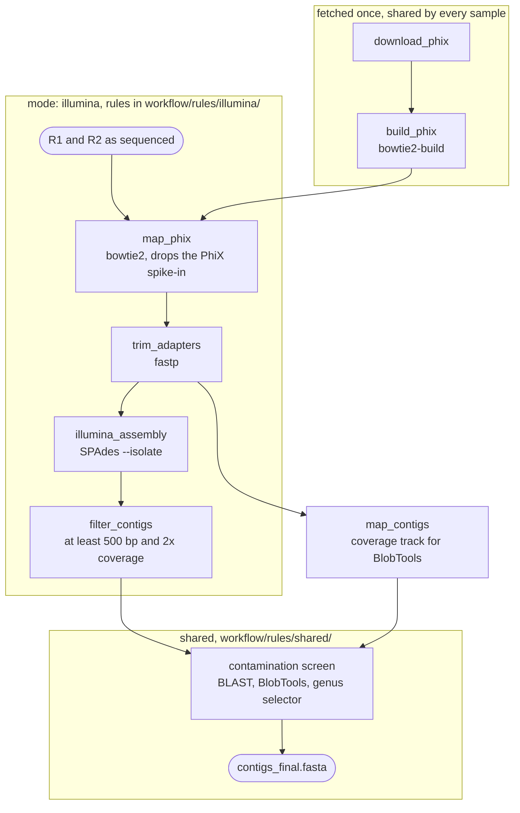

# Illumina mode

`mode: illumina` — Illumina paired-end reads in, a decontaminated SPAdes assembly
out. Six rules, in `workflow/rules/illumina/`.

!!! abstract "Terms used on this page"

    | | |
    |---|---|
    | **AMR** | antimicrobial resistance |

## 1. PhiX removal

An Illumina lane carries a PhiX spike-in — a small bacteriophage genome added as a
sequencing control. Left in, it assembles into a ~5.4 kb contig that is not part of
the isolate and skews the coverage statistics BlobTools later uses to separate
organisms.

`download_phix` fetches the reference named by `links.phix_link`, `build_phix`
indexes it, and `map_phix` runs `bowtie2 --local` per sample keeping the pairs that
did **not** align. The reference and its index are fetched and built once per run,
not once per sample, and both are temporary.

`links.phix_link` is required in this mode: an unset value stops the run at parse
time rather than at the first job.

## 2. Adapter and quality trimming

`trim_adapters` runs fastp with `--detect_adapter_for_pe` (the adapter is inferred
from the pairing itself), `--cut_front` and `--cut_right` for sliding-window quality
trimming, and `--length_required 100`. Adapter read-through and low-quality tails
create false k-mers, which SPAdes turns into short spurious contigs; 100 bp is the
length below which a read stops helping a 127-mer assembly.

It writes `{sample}_fastp.html` for a human and `{sample}_fastp.json` for MultiQC.
Both are kept; the trimmed FASTQs are temporary and survive only until the last rule
that reads them is finished — the assembler, the coverage alignment, the CARD leg
and, when the mobilome copy-number layer is on, the two BBMap depth rules.

## 3. Assembly

`illumina_assembly` runs one SPAdes per sample in `--isolate` mode, which is tuned for
a single high-coverage bacterial culture. The multi-k sweep resolves low-complexity and
repeat-rich regions in one pass, and by default **SPAdes chooses the k-mer ladder
itself** from the read length it measures:

| read length | ladder SPAdes picks |
|---|---|
| ≥ 250 bp | 21, 33, 55, 77, 99, 127 |
| ≥ 150 bp | 21, 33, 55, 77 |
| shorter | 21, 33, 55 |

!!! warning "Passing `-k` switches that off"

    Supplying an explicit ladder disables SPAdes' selection entirely, so a fixed list is
    then applied to whatever read length arrives. K-mer coverage is only a fraction of
    read coverage — `read_cov × (L − k + 1) / L`. On 2×150 data trimmed to ~145 bp,
    k = 127 retains **13%** of it, and the final contigs come from the *largest* k —
    so an over-long ladder means the graph you deliver is the least supported one in
    the run. SPAdes reports the coverage it saw at each k in its log.

    Set [`parameters.spades_kmers`](../reference/configuration.md) to a list only if you
    want to pin the ladder for reproducibility or override SPAdes on unusual data.
    Whatever runs is echoed into the assembly log.

`OMP_NUM_THREADS` is exported alongside `-t` so SPAdes' OpenMP sections obey the
same budget instead of taking every core on the machine, and `-m` is a hard RAM
ceiling from `resources.ram_gb` that SPAdes aborts rather than exceed.

This is the most expensive rule in the mode, and the only one whose threads and
memory are left uncapped.

## 4. Length and coverage filter

`filter_contigs` keeps contigs of **at least 500 bp and at least 2× coverage**,
reading both numbers straight off SPAdes' own header
(`>NODE_1_length_12345_cov_67.8`). A pure-isolate assembly has a long tail of tiny,
low-coverage contigs — sequencing noise, chimeras, fragments of other DNA in the
sample — which add nothing to the annotation but do inflate the contig count, the
CheckM contamination estimate and the BLAST screening time.

The result is `02.assembly/{sample}/contigs_filt.fasta`, the draft the contamination
screen reads. Both cutoffs are fixed in the workflow, not config keys.

## 5. Decontamination is the last assembly step

In this mode the contamination screen writes the delivered genome: `contigs_final.fasta`
*is* the screen's output, with no polishing stage after it. BLAST against NCBI core
nt, the trimmed reads mapped back for a coverage track, BlobTools to combine the two,
and a selector that keeps or drops each contig and writes its reason to
`contaminants/contig_taxonomy_decisions.tsv`. Full detail, including the two ways this
step can delete a real plasmid, is on
[Decontamination](../analysis/decontamination.md).

## What this mode cannot do, and what it gets instead

- **No topology.** Nothing here can say a contig is circular, so Bakta is not handed a
  `--replicons` table and treats every sequence as linear. A gene running across the
  origin is annotated as two fragments.
- **Fragmentation is the constraint on the mobilome module.** Insertion sequences are a
  leading cause of contig breaks — identical copies collapse in the assembly graph, so
  an AMR gene and its flanking IS often land on different contigs. The module runs
  here, reports every call's distance to the contig end, and caps anything spanning
  contigs at low confidence. See [Draft assemblies](../mobilome/draft-assemblies.md).
- **The reads are a second chance.** Mapping reads onto CARD side-steps the assembly
  entirely, so a determinant on a collapsed repeat can be visible in the reads and
  absent from the contigs. That leg runs here and in `hybrid` only — see
  [Antimicrobial resistance](../analysis/amr.md).

## What it writes

| Path | Contents |
|---|---|
| `01.reads/{sample}/illumina/{sample}_fastp.{html,json}` | trimming report |
| `02.assembly/{sample}/spades/` | SPAdes' own output tree, including the unfiltered `contigs.fasta` |
| `02.assembly/{sample}/contigs_filt.fasta` | after the 500 bp / 2× filter |
| `02.assembly/{sample}/contaminants/` | BLAST table, BlobTools table, the decision audit |
| `02.assembly/{sample}/contigs_final.fasta` | the delivered genome |

Environments built: fastp, bowtie, spades, bbmap, qualimap, on top of the set every
mode needs. See [Output files](../reference/output.md) for the rest of the run.
