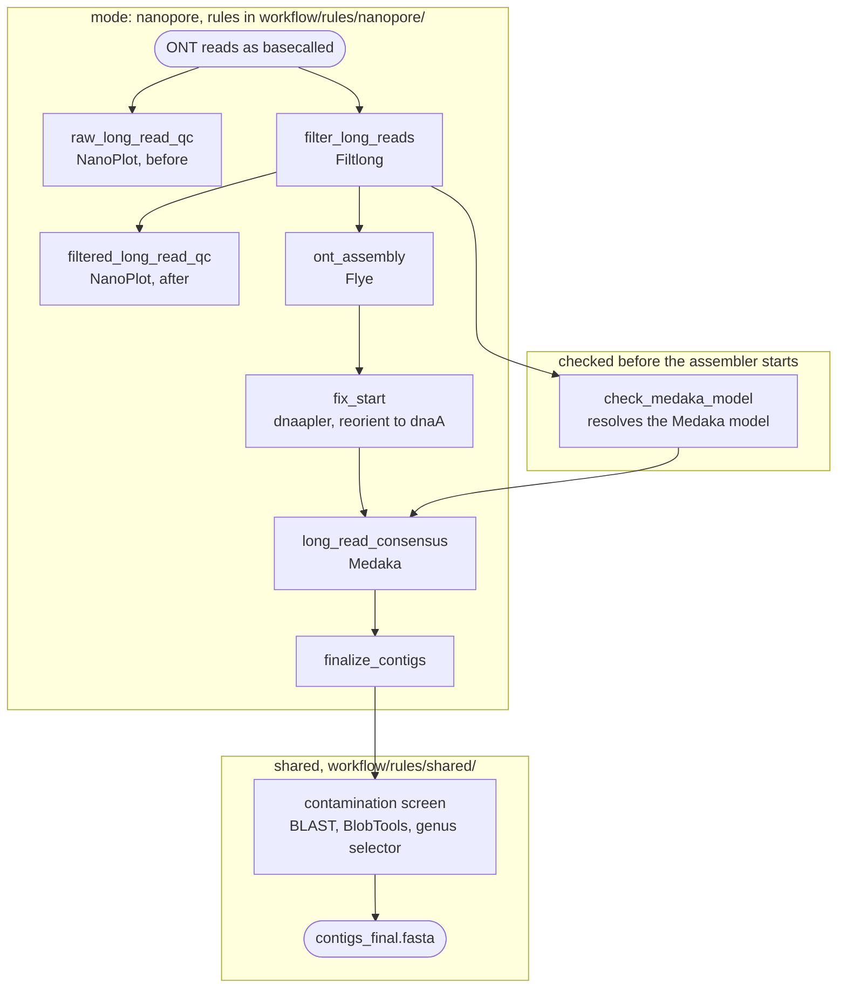

# Nanopore mode

`mode: nanopore` — Oxford Nanopore Technologies (ONT) long reads in, a reoriented,
polished Flye assembly out. Seven rules, in `workflow/rules/nanopore/`.

There is no PhiX step: PhiX is an Illumina spike-in and does not exist in an ONT
library. The Medaka model is resolved *before* Flye runs, so a bad model name costs
seconds rather than an hour of assembly — see
[the model-choice note](../about/medaka-model.md).

!!! abstract "Terms used on this page"

    | | |
    |---|---|
    | **CARD** | Comprehensive Antibiotic Resistance Database |

## 1. Read filtering, and why it is the biggest lever in this mode

An ONT run produces reads of wildly varying length and quality, and far more data
than a bacterial isolate needs. Assembling everything is slower and worse: short,
poor reads add errors without adding contiguity. `filter_long_reads` runs Filtlong
with three settings:

| Flag | From | Default | What it does |
|---|---|---|---|
| `--min_length` | `parameters.long_read_qc.min_length` | 1000 | drops reads too short to span a repeat, which is ONT's whole advantage |
| `--keep_percent` | `parameters.long_read_qc.keep_percent` | 95 | keeps the best N% of the remaining bases, by Filtlong's own score |
| `--target_bases` | fixed at 5×10⁸ | — | stop at ~100× for a 5 Mbp genome; more costs Flye time and buys nothing |

!!! warning "`keep_percent` is what decides whether a small plasmid survives"

    Filtlong ranks reads by a blend of length and quality, and `keep_percent`
    discards the bottom of that ranking. A small plasmid cannot produce reads longer
    than itself, so its reads sit near the bottom by construction and go first.

    Measured on *K. pneumoniae* TUM24772, whose 5,596 bp Col2 plasmid was missing
    from the assembly while sitting complete in the Illumina data: of the 603 raw ONT
    reads covering it, **93** survived the old `keep_percent: 90`, and **500** survive
    the 95 that now ships. Recovering the reads was necessary but not sufficient — no
    setting tried, raw unfiltered reads included, assembled that plasmid.

    `parameters.long_read_qc.length_weight` has **no effect in this mode**: this rule
    passes no `--length_weight`, so Filtlong uses its own default of 1. That key
    reaches Filtlong in `hybrid` mode only.

NanoPlot runs on both sides of the filter — `01.reads/{sample}/ont/raw_qc/` and
`filt_qc/` — so what the filter removed is visible rather than assumed. Read the two
side by side.

## 2. The Medaka model is resolved before anything is assembled

`check_medaka_model` (a shared rule) runs straight after read filtering, validates
`parameters.nanopore.medaka_model` or infers it from the basecaller tag in the read
headers, and writes the resolved name to `{sample}_medaka_model.txt`. The assembler
waits on that file. A typo therefore fails in seconds with a table of suggestions,
instead of an hour later when Flye has already finished.

| `medaka_model` | Effect |
|---|---|
| `auto` (default) | infer from the FASTQ headers; fails with suggestions if they carry no tag |
| an explicit name | validated against the installed model list |
| `false` | Medaka is skipped, and the rule is not defined at all |

Which model `auto` resolves to, why it is the bacterial variant, and when to pin a
different one, are in [The Medaka polishing model](../about/medaka-model.md).

!!! note "Setting the model also changes the assembler"

    With `parameters.nanopore.flye_input_mode: auto` (the default), Flye's read mode
    is derived from the Medaka model name: a name containing **fast** selects
    `--nano-raw`, anything else `--nano-hq`. Fast basecalling means noisier reads, so
    the coupling is deliberate — but it means a change of polisher model silently
    changes the assembly. Set `flye_input_mode` explicitly to pin one without the
    other. The reasoning, and the cases where inference fails, are in
    [`methods_medaka_model_choice.md`](https://github.com/iLivius/BacFlux/blob/main/docs/methods_medaka_model_choice.md).

## 3. Assembly and reorientation

`ont_assembly` runs Flye with `--iterations 5` of its own internal long-read
polishing. Long reads span the repeats that break a short-read assembly, so Flye
usually closes a bacterial chromosome into one circular contig.

A circular sequence has no natural start, and Flye's arbitrary one makes two
assemblies of the same isolate look different. `fix_start` runs `dnaapler all`, which
searches every contig for the canonical start genes at once — *dnaA* for a
chromosome, *repA* for a plasmid, *terL* for a phage — and rotates the sequence to
begin there. It runs at a fixed seed, so a re-run is reproducible.

Two by-products are used later:

- `ignore_list.txt`, written from Flye's `assembly_info.txt`, lists the contigs Flye
  did **not** call circular. Rotating a linear contig would move its true ends into
  the middle, so dnaapler is told to leave those alone.
- `{sample}_all_reorientation_summary.tsv` records which start gene was found on each
  contig and how convincingly. Together with Flye's circularity column it builds the
  `--replicons` table handed to Bakta, so the annotation knows which sequences are
  closed chromosomes and can call a gene that runs across the origin.

Headers are trimmed to their first whitespace token here, because Bakta, Platon,
geNomad and the BLAST screen all join on that token.

## 4. Order: screen first, polish second

The contamination screen runs on the **reoriented** assembly, and Medaka polishes the
**decontaminated** one. Polishing a contaminant contig with this isolate's reads would
waste effort and could smear real differences.

`finalize_contigs` then copies whichever file ended the chain — the Medaka consensus,
or the decontaminated assembly when Medaka is off — to `contigs_final.fasta`, and logs
which one it copied. That one line is the provenance of the delivered genome.

## What this mode has that the short-read modes do not

- **Topology.** Flye's circularity calls reach Bakta, so closed replicons are
  annotated as closed.
- **Contiguity.** The mobilome module's element boundaries are far more meaningful on
  a closed genome; on a draft the class survives fragmentation but the extent does
  not ([Draft assemblies](../mobilome/draft-assemblies.md)).

## What it gives up

- **No read-based CARD screen.** That leg needs short reads. ABRicate on the contigs
  still runs ([Antimicrobial resistance](../analysis/amr.md)).
- **No length or coverage filter on the contigs.** The reoriented assembly reaches the
  screen as Flye left it.
- **Residual base errors** are what Medaka fixes; switching it off leaves them in.
  Indels in homopolymers frameshift genes and ruin an annotation.

## What it writes

| Path | Contents |
|---|---|
| `01.reads/{sample}/ont/raw_qc/`, `filt_qc/` | NanoPlot, before and after filtering |
| `01.reads/{sample}/ont/{sample}_filt.fastq` | the reads Flye assembled and Medaka polished |
| `02.assembly/{sample}/flye/` | `assembly.fasta`, `assembly_info.txt`, `ignore_list.txt` |
| `02.assembly/{sample}/fix_start/` | dnaapler's output and the reorientation summary |
| `02.assembly/{sample}/medaka/` | `consensus.fasta` (absent when Medaka is off) |
| `02.assembly/{sample}/{sample}_replicons.tsv` + `_audit` | the table Bakta is given, and the reason per contig |
| `02.assembly/{sample}/contigs_final.fasta` | the delivered genome |
